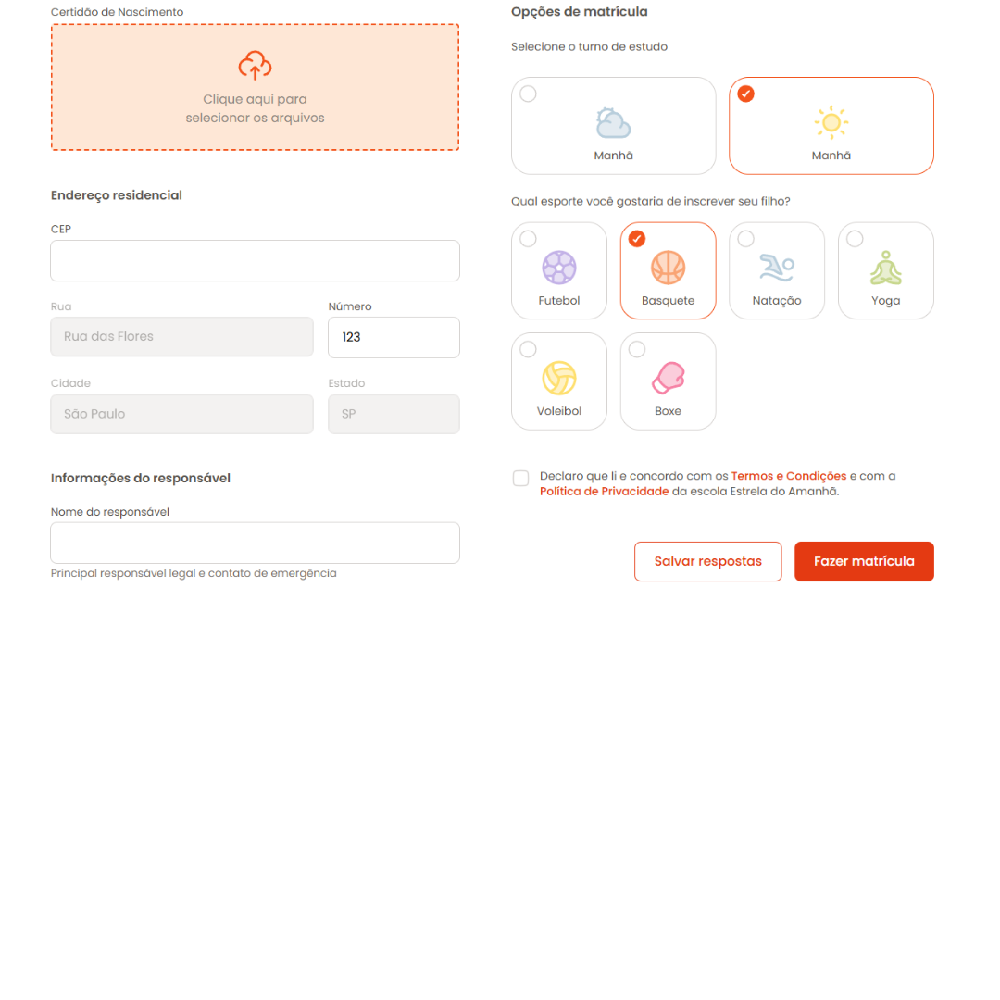

<h1 align="center"> Formulário de Matrícula </h1>

Este é um Formulário de Matrícula feito com HTML e CSS, utilizando conceitos de Forms, Flex e Grid. 

  
  

## 🚀 Tecnologias

Esse projeto foi desenvolvido com as seguintes tecnologias:

- HTML e CSS
- Git e Github
- Figma
- Canva

- [Acesse o projeto finalizado online!](https://vhbiten.github.io/Formulario-de-Matricula/)
